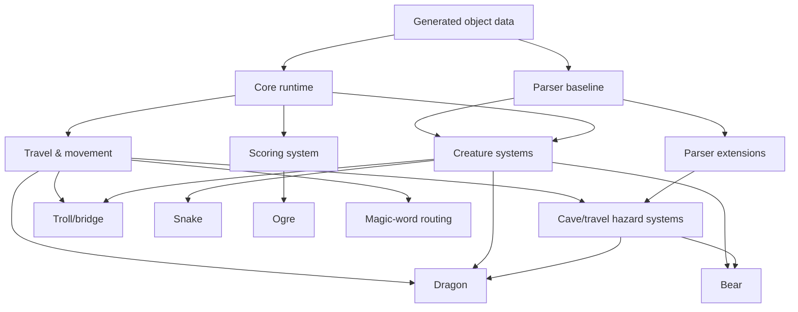

# Gameplay Systems Architecture (Milestone 3A)

## Goal

Define gameplay systems required by Open Adventure and map how objects from
`source/adventure.yaml` interact with generated object definitions and shared
runtime state.

This is architectural only: no gameplay implementation changes are included.

## System inventory and boundaries

### 1) Core world/runtime system

- **Participating objects**: all roomed objects and inventory-carryable objects
- **Required state variables**: `loc`, `newloc`, `oldloc`, `room states` (from
  generated layout), `dflag`, `tally`, `holdng`, `closed/closng`,
  `clock1/clock2`, `objects[].place`, `objects[].prop`, `objects[].fixd`.
- **Room dependencies**: all rooms and exits.
- **Inventory dependencies**: all takeable objects.
- **Scoring dependencies**: `tally` accumulation from actions and object state.
- **Travel dependencies**: all travel handlers route through this system.
- **Parser dependencies**: default verb-to-object/action mapping.
- **Generated**: movement/room schema, noun resolution, static text/placement.
- **Hand-written**: world initialization sequencing, world-state synchronization, turn clock.

### 2) Travel & movement behavior system

- **Participating objects**:
  - `GRATE`, `STEPS`, `DOOR`, `FISSURE`, `CHASM`, `PLANT`, `MESSAG`, `RESER`
  - `OBJ_13`, `OBJ_47`, `OBJ_48`, `SIGN`
- **Required state variables**:
  - `newloc`, `loc`, object `prop` per obstacle
  - special travel booleans (`closed/closng`) and object state predicates
  - timer-like globals for delayed hazards where needed
- **Room dependencies**: room graph plus special transition conditions.
- **Inventory dependencies**: axe/rope/chain-like gating objects are checked by this system.
- **Scoring dependencies**: optional, only when movement yields/blocks object recovery.
- **Parser dependencies**: custom commands (`climb`, `jump`, `cross`, etc.) and
  directional fallback handling.
- **Generated**: object metadata, static descriptions, room indices.
- **Hand-written**: edge predicate logic, blocked/allowed matrix, fall/death branches,
  and message dispatch.
- **Reusable subsystem**: generic transition guard layer usable by other movement systems.

### 3) Dwarf system

- **Participating objects**: `DWARF` (+ pirate encounters from source context where applicable)
- **Required state variables**: `dwarves[]`, `dflag`, `loc/newloc`, `holdng`,
  parser context state.
- **Room dependencies**: rooms reachable from start and hall areas.
- **Inventory dependencies**: object theft checks and possession-based hostility.
- **Scoring dependencies**: dwarf-related negative/positive event scoring.
- **Travel dependencies**: warning and blocking behavior on approach.
- **Parser dependencies**: `attack`, `shoot`, `drop`, and object verbs when dwarves are nearby.
- **Generated**: initial placement and static object metadata.
- **Hand-written**: NPC movement loop, encounter timing, branchy text and combat resolution.
- **Reusable subsystem**: configurable "wandering hostile actor" base.

### 4) Troll/bridge system

- **Participating objects**: `TROLL`, `TROLL2`, `CHASM`, `RUG`-adjacent flows (where applicable)
- **Required state variables**: obstacle props, `loc/newloc`, travel state, conditional object flags.
- **Room dependencies**: troll bridge/chasm rooms.
- **Inventory dependencies**: `AXE`/exchange logic and inventory-sensitive passage checks.
- **Scoring dependencies**: reward or penalty adjustments tied to troll resolution.
- **Travel dependencies**: direct traversal gating and one-way fallback behavior.
- **Parser dependencies**: bridge/troll/attack/read/cross branches.
- **Generated**: object descriptors and initial state.
- **Hand-written**: NPC state transitions and travel override outcomes.
- **Reusable subsystem**: "escort/obstacle removal" encounter pattern.

### 5) Dragon system

- **Participating objects**: `DRAGON` and dragon-adjacent puzzle objects (axe/rug/coins context)
- **Required state variables**: `loc`, `holdng`, `tally`, object `prop`, global conditions.
- **Room dependencies**: treasure cave region and adjacent guard rooms.
- **Inventory dependencies**: axe availability and held treasure conditions.
- **Scoring dependencies**: dragon event typically influences endgame score thresholds.
- **Travel dependencies**: block/unblock around dragon room edges.
- **Parser dependencies**: `attack`, `kill`, `throw`, `say` and room-exit special branches.
- **Generated**: creature baseline.
- **Hand-written**: vulnerability logic, kill/death messaging, aftermath transitions.
- **Reusable subsystem**: reusable "stronghold NPC + weak-by-item" behavior.

### 6) Bear system

- **Participating objects**: `BEAR`, `CHAIN`, `FOOD`, `AXE`
- **Required state variables**: object `prop`, `loc/newloc`, possession checks.
- **Room dependencies**: bridge/boulder area rooms and movement choke points.
- **Inventory dependencies**: chain/food/weapon handling and carry capacity.
- **Scoring dependencies**: object retention/consumption effects.
- **Travel dependencies**: encounter gating and room entry outcomes.
- **Parser dependencies**: `attack`, `feed`, `take`, `throw`, `untie`.
- **Generated**: creature/object placement.
- **Hand-written**: stateful bear encounter sequences and branchy outcomes.
- **Reusable subsystem**: "single hostile obstacle with consumable bait/mitigation".

### 7) Snake system

- **Participating objects**: `SNAKE`
- **Required state variables**: `chloc/chloc2`, `prop`, `loc/newloc`.
- **Room dependencies**: hall/chasm-adjacent rooms where encounter is possible.
- **Inventory dependencies**: item possession affects attack odds and escape paths.
- **Scoring dependencies**: snake encounter outcomes.
- **Travel dependencies**: forced movement and blocked transitions.
- **Parser dependencies**: verb handling for snake-targeting actions.
- **Generated**: creature baseline.
- **Hand-written**: chase/encounter path and delayed state updates.
- **Reusable subsystem**: chase-actor pattern with zone memory.

### 8) Ogre system

- **Participating objects**: `OGRE`
- **Required state variables**: `loc/newloc`, `tally`, condition bits.
- **Room dependencies**: ogre ambush room(s).
- **Inventory dependencies**: weapons and defensive items for interaction.
- **Scoring dependencies**: kill/avoid score outcomes.
- **Travel dependencies**: route restrictions on approach/escape.
- **Parser dependencies**: attack/protect/flee verbs.
- **Generated**: baseline creature data.
- **Hand-written**: encounter and persistence model.
- **Reusable subsystem**: single NPC ambush module.

### 9) Plant/Cavitation/Reservoir message cluster

- **Participating objects**: `PLANT`, `PLANT2`, `CAVITY`, `RESER`
- **Required state variables**: object `prop`, room state, timer flags where applicable.
- **Room dependencies**: fixed garden/canyon/room clusters.
- **Inventory dependencies**: items used to test conditionals.
- **Scoring dependencies**: negligible direct score, indirect via progression.
- **Travel dependencies**: discovery and route unlocking.
- **Parser dependencies**: `read`, `touch`, `open`, `pour`, `drink`, etc.
- **Generated**: base object state and vocabulary.
- **Hand-written**: conditional text/state branching and side effects.

### 10) Treasure / scoring system

- **Participating objects**: all score-bearing movable objects plus creatures that guard them.
- **Required state variables**: `tally`, `objects[].place`, score table, endgame completion flags.
- **Room dependencies**: location-dependent reward/penalty placement.
- **Inventory dependencies**: inventory list (`holdng` and related checks) for score milestones.
- **Scoring dependencies**: primary owner of progression win/lose accounting.
- **Travel dependencies**: location-based pickup/delivery conditions.
- **Parser dependencies**: `take/drop/give/throw/say` where score triggers happen.
- **Generated**: item descriptors and score metadata.
- **Hand-written**: all score deltas, end conditions, and anti-gaming checks.
- **Reusable subsystem**: centralized score service decoupled from parser actions.

### 11) Magic-word and parser-resolved command extension

- **Participating objects**: `PLANT`/`VOLCANO`/other special objects used by `reservoir`-style rules.
- **Required state variables**: global command mode, travel lock flags, parser state.
- **Room dependencies**: special room clusters (e.g., reservoir/chasm-related zones).
- **Inventory dependencies**: carried trigger tokens required by some sequences.
- **Scoring dependencies**: usually none directly; often enables late-game pathing.
- **Travel dependencies**: may unlock hidden movement routes.
- **Parser dependencies**: `say`, `reservoir`, `extinguish`, and custom preconditions.
- **Generated**: noun recognition and object binding.
- **Hand-written**: command-to-state transitions and command side effects.

## Implementation strategy: generated vs hand-written

### Generated

- Object and room schema
- Vocabulary + parser object lookup table
- Initial object/world state
- Static responses for non-branching prompts

### Hand-written

- Rule-specific state machines for all non-trivial systems (dwarf, dragon, troll, bear, snake, ogre, movement exceptions)
- Travel override hooks and post-action side effects
- Cross-system interactions (score + inventory + room state transitions)
- Parser special-cases and one-off diagnostics

### Reusable subsystems

1. Finite-state obstacle subsystem (`prop`-driven transitions).
2. NPC actor controller with move/attack state machine.
3. Travel guard graph with system-specific override pipeline.
4. Room-sensitive command router for dynamic verb binding.
5. Loot/state scoreboard service.

## Implementation order (non-executable roadmap)

1. Core runtime scaffolding (state structs + generated object load/registry).
2. Travel guard layer + object/room lookup integration.
3. Inventory and parser baseline action routing.
4. Scoring/treasure bookkeeping service.
5. Dwarf and pirate-adjacent interactions.
6. Cave/tunnel/chasm/travel exception systems (including `CHASM`, `GRATE`, `FISSURE`, `STEPS`, `DOOR`).
7. Troll/bridge and bear systems.
8. Dragon and snake systems.
9. Ogre and magic-word/parser extension polish.
10. End-to-end integration pass and regression matrix by system.

## Dependency graph between systems

## Effort estimates

- Core runtime + parser baseline: **M**
- Travel guard layer: **M**
- Dwarf system: **M**
- Troll/bridge system: **M**
- Dragon system: **L**
- Bear/Snake/Ogre systems: **M** each
- Scoring/service layer: **S-M**
- Magic-word/parser extensions: **M**
- System integration + dependency graph cleanup: **M**

Key: S=1–2 days, M=3–5 days, L=6–10 days.

## Risk assessment

- **High**
  - Parser/action compatibility drift vs Open Adventure C/Conley/NI behavior.
  - Hidden cross-system side effects (especially movement + score + NPC state).
  - Incorrect ordering between travel guard and creature encounter systems.
- **Medium**
  - Incomplete matching of legacy object IDs (legacy names like `OBJ_13`, `OBJ_47`, `OBJ_48`).
  - State synchronization between generated object props and hand-written system state.
  - Endgame timing/cave-closing interactions with non-direct travel.
- **Low**
  - Static object metadata mismatches (descriptions, synonyms, initial locations).

## Recommended implementation shape

- Keep system boundaries explicit in code, with each subsystem owning:
  - event entry points,
  - state transitions,
  - and a narrow command parser contract.
- Use generated data as a source of truth for nouns/layout and as initial conditions.
- Route all complex outcomes through named gameplay systems so regressions are traceable by system.
