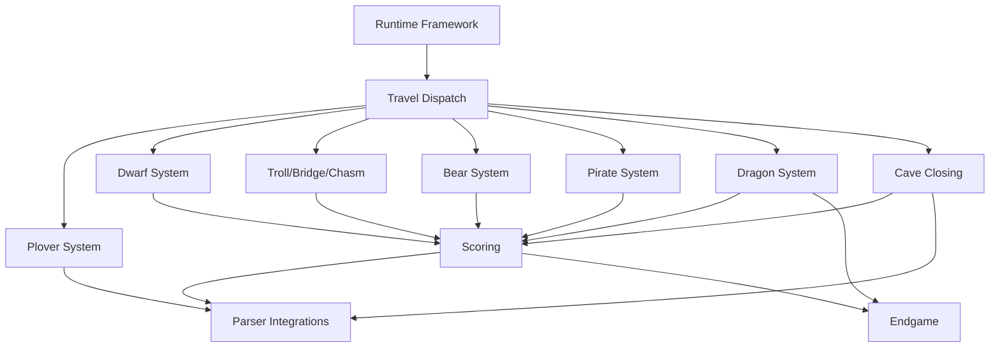

# Project Roadmap

## Completed milestones

- 2A: data extraction and world-object analysis
- 2B: vocabulary analysis
- 2C: architecture baseline
- 2D: unresolved travel tracing and classification
- 3A: gameplay systems mapping
- 3B: runtime framework foundations
- 3C: travel dispatch integration
- 3D: unresolved travel/behavior documentation and plover-related work
- 3E: first compilable build
- 3F: repository status and architecture refresh
- 4A: plover system implementation
- 4B: troll/bridge/chasm subsystem implementation
- 4C: dwarf subsystem travel-gating integration
- 4D: dwarf subsystem baseline completion and verification

## Current build status

- Compile pipeline: ✅ working.
- Command: `./build.sh --compile`
- Artifact: `OpenAdventure.inform/Build/OpenAdventure.z8`
- Generator + runtime integration verified in build composition.

## Current gameplay status

- Implemented: baseline movement framework, plover travel, troll/bridge/chasm travel, and dwarf baseline behavior.
- Not yet implemented:
  - bear system
  - pirate system
  - dragon system
  - cave-closing logic
  - full scoring flow
  - endgame flow
  - full generated-edge dwarf movement parity

## Testing status

- Automated compile smoke exists via build script + test entrypoint.
- Transcript-based behavioral regression framework is still pending.

## Remaining systems and priority

1. `dwarf parity hardening` — replace simplified pressure movement with generated-edge movement candidates and add transcript tests.
2. `pirate` — treasure theft and dwarf/pirate ordering.
3. `bear` — resolve movement/encounter behaviors and state transitions.
4. `cave-closing` — introduce global closure state transitions and constraints.
5. `scoring / treasure` — scoring side effects and inventory checks.
6. `dragon` and `endgame` — encounter flow, victory/lose states, terminal sequences.

## Recommended implementation order

- Foundation hardening (already in place): runtime hooks, condition predicates, travel dispatch context.
- Resolve unresolved travel gates in isolation, one system at a time, with stub fallback and regression command lists.
- Add persistent system state and parser support for each module before integration.
- Implement scoring and cave-closing in dependency order after travel and object constraints are stable.
- Finish endgame and parser UX polish once remaining core systems are stable.

## Dependency graph

## Risks

- Gameplay-system side effects may interact in non-obvious order.
- Parser and travel dispatch must remain stable while systems are added.
- Missing or ambiguous reference behavior can cause false positives in travel gating.

## Progress reporting model

Each gameplay system should be delivered as:
1. analysis note (room/inventory/flags)
2. state model
3. extension points used in runtime
4. behavior implementation
5. regression command checklist

## Notes for contributors

- Keep unresolved special rules explicit until behavior is fully mapped.
- Prefer minimal invasive changes in generated integration layer.
- Record every implementation decision in corresponding architecture docs before merge.
